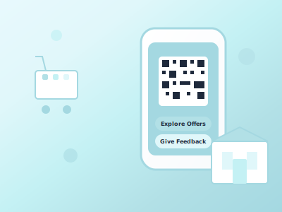

# ShopEase - QR-Powered Retail Experience



ShopEase is a comprehensive digital engagement platform that transforms the in-store shopping experience through QR code-based access to offers, product catalogs, and feedback collection. Built with modern web technologies and featuring the beautiful "Tranquil Waters" design theme.

## 🌟 Features

### For Shoppers
- **QR Code Access**: Instant access to offers by scanning QR codes at store entrance or specific sections
- **Exclusive Offers**: Browse categorized offers with preview mode and full access post-signup
- **Section-Specific Experience**: Different QR codes for different store sections (Jewelry, Fashion, Kids, etc.)
- **Easy Sign-up**: Simple registration with Name, Mobile, Email and mock OTP verification
- **Feedback System**: Rate your shopping experience with configurable questions and overall ratings
- **Mobile-First Design**: Beautiful, responsive UI optimized for mobile devices

### For Store Managers
- **Dashboard Overview**: Comprehensive analytics dashboard with key metrics
- **QR Code Generation**: Create and download QR codes for store and sections
- **Offer Management**: Manual entry and Excel bulk upload for daily offers
- **Sales Data Upload**: End-of-day sales data import via Excel files
- **Analytics & Insights**: Track QR scans, conversions, customer behavior, and performance metrics
- **Customer Feedback**: View and analyze customer feedback and ratings

### For Administrators
- **Multi-Store Management**: Manage multiple stores from a single dashboard
- **Performance Summaries**: View aggregated performance across all stores
- **Store Onboarding**: Easy setup process for new stores

## 🎨 Design Theme

ShopEase features the **Tranquil Waters** color palette, creating a calm and serene user experience:
- Primary: `#A4D8E1` (Tranquil Blue)
- Secondary: `#B2E0E6` (Light Tranquil)
- Accent: `#C4F1F4` (Medium Tranquil)
- Background: `#E0F7FA` (Soft Tranquil)
- Light: `#E8F9FD` (Lightest Tranquil)

## 🛠 Tech Stack

### Frontend
- **Framework**: Next.js 14 (React)
- **Styling**: Tailwind CSS
- **UI Components**: Shadcn UI
- **Icons**: Lucide React
- **Charts**: Recharts
- **QR Codes**: qrcode.react
- **Notifications**: Sonner

### Backend
- **Runtime**: Node.js
- **Framework**: Express.js
- **Database**: Supabase (PostgreSQL)
- **Authentication**: Supabase Auth
- **File Upload**: Multer
- **Excel Processing**: xlsx
- **CORS**: cors
- **Logging**: Morgan

### Database & Services
- **Database**: Supabase PostgreSQL
- **Storage**: Supabase Storage
- **Authentication**: Supabase Auth
- **Real-time**: Supabase Realtime

## 📁 Project Structure

```
shop_ease/
├── frontend/                 # Next.js frontend application
│   ├── app/                 # App router pages
│   │   ├── (shopper)/       # Shopper-facing pages
│   │   ├── (dashboard)/     # Manager dashboard pages
│   │   ├── auth/           # Authentication pages
│   │   └── dashboard/      # Dashboard pages
│   ├── components/         # Reusable UI components
│   │   └── ui/            # Shadcn UI components
│   ├── lib/               # Utility functions and API client
│   └── public/            # Static assets
├── backend/                # Express.js backend API
│   ├── src/
│   │   ├── routes/        # API route handlers
│   │   └── services/      # External service integrations
│   └── server.js          # Main server file
└── README.md              # This file
```

## 🚀 Getting Started

### Prerequisites
- Node.js 18+ 
- npm or yarn
- Supabase account and project

### Environment Setup

1. **Clone the repository**
```bash
git clone <repository-url>
cd shop_ease
```

2. **Frontend Environment Variables**
Create `frontend/.env.local`:
```env
NEXT_PUBLIC_SUPABASE_URL=your_supabase_url
NEXT_PUBLIC_SUPABASE_ANON_KEY=your_supabase_anon_key
```

3. **Backend Environment Variables**
Create `backend/.env`:
```env
SUPABASE_URL=your_supabase_url
SUPABASE_SERVICE_ROLE_KEY=your_supabase_service_role_key
CORS_ORIGIN=http://localhost:3000
PORT=5000
```

### Installation & Running

1. **Install Frontend Dependencies**
```bash
cd frontend
npm install
npm run dev
```

2. **Install Backend Dependencies**
```bash
cd backend
npm install
npm run dev
```

3. **Access the Application**
- Frontend: http://localhost:3000
- Backend API: http://localhost:5000

## 📊 Database Schema

### Core Tables
- `stores` - Store information and configuration
- `offers` - Product offers and deals
- `categories` - Offer categories
- `qr_scans` - QR code scan tracking
- `feedback_questions` - Configurable feedback questions
- `feedback_responses` - Customer feedback responses
- `sales_data` - Daily sales information
- `users` - Customer information

## 🔗 API Endpoints

### Offers
- `GET /api/offers` - List offers with filtering
- `POST /api/offers` - Create new offer
- `PUT /api/offers/:id` - Update offer
- `DELETE /api/offers/:id` - Delete offer
- `POST /api/offers/bulk` - Bulk upload via Excel

### Analytics
- `POST /api/analytics/scan` - Record QR scan
- `GET /api/analytics/overview` - Get analytics overview
- `GET /api/analytics/daily-scans` - Daily scan trends
- `GET /api/analytics/feedback-summary` - Feedback analytics

### Feedback
- `GET /api/feedback/questions` - Get feedback questions
- `POST /api/feedback/submit` - Submit feedback

### Authentication
- `POST /api/auth/signup` - User registration
- `POST /api/auth/verify` - OTP verification

### Sales
- `POST /api/sales/upload` - Upload sales data

### Categories
- `GET /api/categories` - List categories

## 🎯 User Journeys

### Shopper Journey
1. **QR Scan**: Customer scans QR code at store entrance or section
2. **Landing Page**: Sees store-specific landing page with options
3. **Browse Offers**: Views categorized offers (preview mode initially)
4. **Sign Up**: Registers with name, mobile, email
5. **OTP Verification**: Verifies with mock OTP (123456 for demo)
6. **Full Access**: Unlocks complete offer catalog
7. **Section Experience**: Scans section-specific QR for filtered offers
8. **Feedback**: Provides feedback at checkout via QR scan

### Store Manager Journey
1. **Dashboard Access**: Logs into manager dashboard
2. **Store Setup**: Configures store profile and settings
3. **QR Generation**: Creates and downloads QR codes for store/sections
4. **Daily Offers**: Uploads offers manually or via Excel bulk upload
5. **Analytics Review**: Monitors performance metrics and customer engagement
6. **Sales Upload**: Imports end-of-day sales data for analytics

## 🎨 UI/UX Features

### Design Principles
- **Mobile-First**: Optimized for mobile devices with responsive design
- **Tranquil Waters Theme**: Calming color palette for relaxed shopping
- **Smooth Animations**: Floating animations, fade-ins, and hover effects
- **Swipe-Based UI**: Horizontal scrolling for offer browsing
- **Intuitive Navigation**: Clear CTAs and logical flow

### Key Components
- **Tranquil Cards**: Semi-transparent cards with backdrop blur
- **Gradient Buttons**: Beautiful gradient buttons with hover effects
- **Star Ratings**: Interactive star rating components
- **Progress Indicators**: Smooth progress bars for uploads
- **Responsive Charts**: Analytics charts that adapt to screen size

## 📱 Mobile Responsiveness

ShopEase is built mobile-first with:
- Responsive grid layouts
- Touch-friendly interface elements
- Optimized QR code scanning experience
- Swipe gestures for offer browsing
- Mobile-optimized forms and inputs

## 🔧 Development Features

### Code Quality
- TypeScript-ready structure
- ESLint configuration
- Component-based architecture
- Reusable UI components
- Clean API design

### Performance
- Next.js optimizations
- Image optimization
- Lazy loading
- Efficient state management
- Optimized bundle size

## 🚀 Deployment

### Frontend (Vercel)
```bash
cd frontend
npm run build
# Deploy to Vercel
```

### Backend (Render/Railway)
```bash
cd backend
npm start
# Deploy to your preferred platform
```

## 📋 Demo Video Script

### Introduction (30 seconds)
"Welcome to ShopEase - the future of retail shopping experience. Transform your store with QR code-powered access to offers, analytics, and customer feedback."

### Shopper Experience (2 minutes)
1. Show QR code scanning at store entrance
2. Demonstrate beautiful landing page with Tranquil Waters theme
3. Browse offers in preview mode
4. Sign up process with elegant forms
5. OTP verification with mock code
6. Full catalog access with swipe-based UI
7. Section-specific QR experience
8. Feedback submission with star ratings

### Manager Dashboard (2 minutes)
1. Dashboard overview with analytics
2. QR code generation and download
3. Manual offer creation with beautiful forms
4. Excel bulk upload demonstration
5. Sales data upload process
6. Analytics dashboard with charts and insights

### Mobile Responsiveness (1 minute)
1. Show responsive design on different screen sizes
2. Touch interactions and swipe gestures
3. Mobile-optimized forms and navigation

### Conclusion (30 seconds)
"ShopEase combines beautiful design with powerful functionality to create the ultimate retail experience. Ready to transform your store?"

## 🤝 Contributing

1. Fork the repository
2. Create a feature branch
3. Make your changes
4. Test thoroughly
5. Submit a pull request

## 📄 License

This project is licensed under the MIT License.

## 🆘 Support

For support and questions:
- Create an issue in the repository
- Contact the development team
- Check the documentation

---

Built with ❤️ using the Tranquil Waters design theme for a serene shopping experience.
